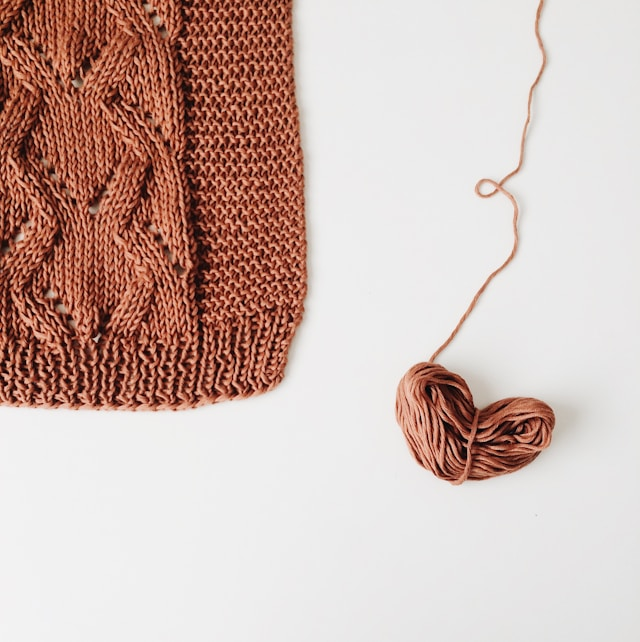

# **Viikko 1 tehtävä**

## Lista

<ul>
  <li>Kevät</li>
  <li>Kesä</li>
  <li>Syksy</li>
  <li>Talvi</li>
</ul>

## Listan koodi

```
{
  <ul>
  <li>Kevät</li>
  <li>Kesä</li>
  <li>Syksy</li>
  <li>Talvi</li>
</ul>
}
```

## Kuva


## Linkki

[*Linkki Centrian sivuille.*](https://net.centria.fi)

## Taulukko

| Opiskelijan nimi | Opiskelijanumero |
| ----------- | ----------- |
| Maija Meikäläinen | 0000 |
| Matti Meikäläinen | 1111 |
| Taavi Testaaja | 2222|

## Lainaus

>"The true sign of intelligence is not knowledge but imagination" - Albert Einstein

---
---
---

# **Esittely**

## Tietoja *minusta*

<ul>
  <li>Nimi: Jonna</li>
  <li>Opinnot: Tieto- ja viestintätekniikan insinööri (AMK)</li>
  <li>Aloitusvuosi: 2025</li>
</ul>

[*Linkki opintokuvaukseen*](https://net.centria.fi/koulutukset/insinoori-amk-tieto-ja-viestintatekniikka)

## Kiinnostuksen kohteet

Kiinnostuksen kohteitani ja harrastuksiani:

| Nro | Harrastus |
| ----------- | ----------- |
| 1 | Tietotekniikka |
| 2 | Lukeminen |
| 3 | Käsityöt|

 

>“A reader lives a thousand lives before he dies . . . The man who never reads lives only one.” - George R.R. Martin


 ---

### Koodi:

```
{
<ul>
  <li>Nimi: Jonna</li>
  <li>Opinnot: Tieto- ja viestintätekniikan insinööri (AMK)</li>
  <li>Aloitusvuosi: 2025</li>
</ul>
}
```
 ---
